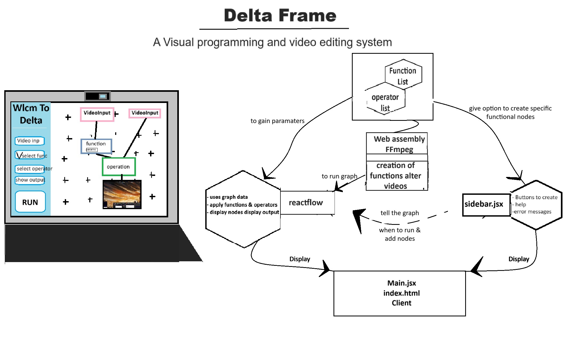

todo: 
- read more ffmpeg
    - the goal is such that the output node can produce complex filtergraph 
     - to keep the system modular it would make sence for each node to produce filter based on what came before it, learn how these work
- defualt videos
- implementation of ffmpeg starts with understanding compelex filtergraphs and how they are generated
- prevent a node from linking to it'self

